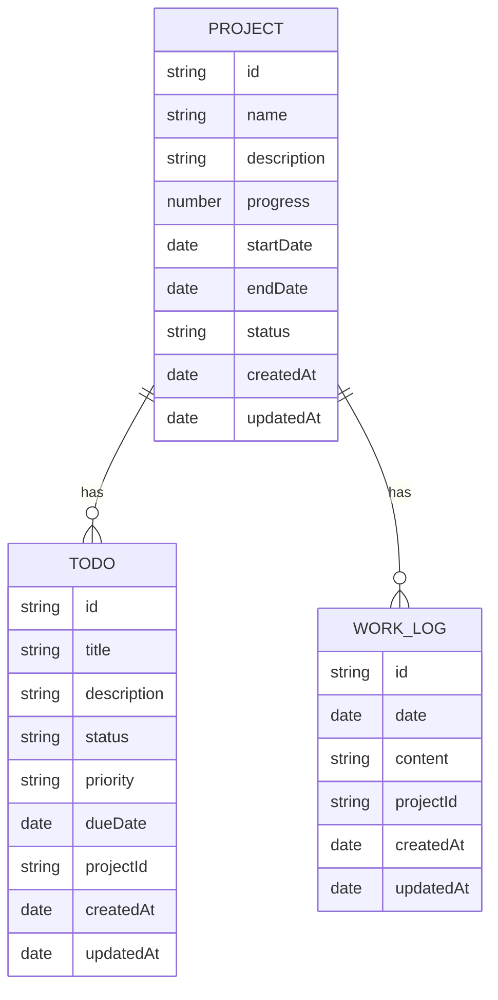

# 工作日志管理系统 - 技术架构文档

## 1. 架构设计

```mermaid
graph TB
    subgraph "前端 (Vue 3 + Vite)"
        A[组件层] --> B[状态管理 (Pinia)]
        A --> C[路由 (Vue Router)]
        B --> D[数据存储 (LocalStorage + IndexedDB)]
    end
    
    subgraph "外部服务"
        E[大模型 API]
    end
    
    A --&gt; E
```

## 2. 技术选型

- **前端框架**: Vue 3 + Composition API + TypeScript
- **构建工具**: Vite
- **UI 组件库**: Naive UI
- **状态管理**: Pinia
- **路由**: Vue Router
- **样式**: Tailwind CSS
- **数据存储**: LocalStorage (基础配置) + IndexedDB (日志、项目、待办数据)
- **图表**: ECharts

## 3. 路由定义

| 路由 | 页面组件 | 用途 |
|------|----------|------|
| / | Dashboard | 工作台（首页） |
| /calendar | Calendar | 日历视图 |
| /projects | Projects | 项目列表 |
| /projects/:id | ProjectDetail | 项目详情 |
| /todos | Todos | 待办事项 |
| /ai-assistant | AiAssistant | 智能助手 |
| /settings | Settings | 设置 |

## 4. 数据模型

### 4.1 数据模型定义



### 4.2 TypeScript 类型定义

```typescript
// 项目类型
interface Project {
  id: string;
  name: string;
  description: string;
  progress: number; // 0-100
  startDate: string;
  endDate?: string;
  status: 'planning' | 'in_progress' | 'completed' | 'paused';
  createdAt: string;
  updatedAt: string;
}

// 待办类型
interface Todo {
  id: string;
  title: string;
  description?: string;
  status: 'pending' | 'in_progress' | 'completed';
  priority: 'low' | 'medium' | 'high';
  dueDate?: string;
  projectId?: string;
  createdAt: string;
  updatedAt: string;
}

// 工作日志类型
interface WorkLog {
  id: string;
  date: string; // YYYY-MM-DD
  content: string;
  projectId?: string;
  createdAt: string;
  updatedAt: string;
}

// AI 对话消息类型
interface AiMessage {
  id: string;
  role: 'user' | 'assistant';
  content: string;
  timestamp: string;
}
```

## 5. 项目结构

```
Work Log Management System-Personal/
├── frontend/
│   ├── src/
│   │   ├── components/       # 通用组件
│   │   ├── views/            # 页面组件
│   │   ├── stores/           # Pinia 状态管理
│   │   ├── router/           # 路由配置
│   │   ├── utils/            # 工具函数
│   │   ├── types/            # TypeScript 类型定义
│   │   ├── App.vue
│   │   └── main.ts
│   ├── index.html
│   ├── package.json
│   ├── vite.config.ts
│   ├── tailwind.config.js
│   └── tsconfig.json
└── 需求文档.md
```

## 6. 核心功能实现思路

### 6.1 数据持久化
- 使用 LocalStorage 存储用户配置和轻量级数据
- 使用 IndexedDB 存储大量的日志、项目、待办数据
- 实现数据的导入导出功能（JSON 格式）

### 6.2 日历视图
- 基于原生 Date API 实现日历逻辑
- 支持月份切换和日期选择
- 点击日期添加/编辑当天日志

### 6.3 智能助手
- 预留大模型 API 接口
- 提供日志模板、周报生成等预置功能
- 对话式交互界面

## 7. 初始数据

```typescript
// 示例项目数据
const sampleProjects: Project[] = [
  {
    id: '1',
    name: 'XX 国企信息化平台建设',
    description: '企业数字化转型核心项目',
    progress: 45,
    startDate: '2024-01-15',
    endDate: '2024-12-31',
    status: 'in_progress',
    createdAt: new Date().toISOString(),
    updatedAt: new Date().toISOString()
  }
];

// 示例待办数据
const sampleTodos: Todo[] = [
  {
    id: '1',
    title: '编写项目需求文档',
    description: '与客户确认需求并形成正式文档',
    status: 'completed',
    priority: 'high',
    projectId: '1',
    dueDate: '2024-02-28',
    createdAt: new Date().toISOString(),
    updatedAt: new Date().toISOString()
  }
];
```
