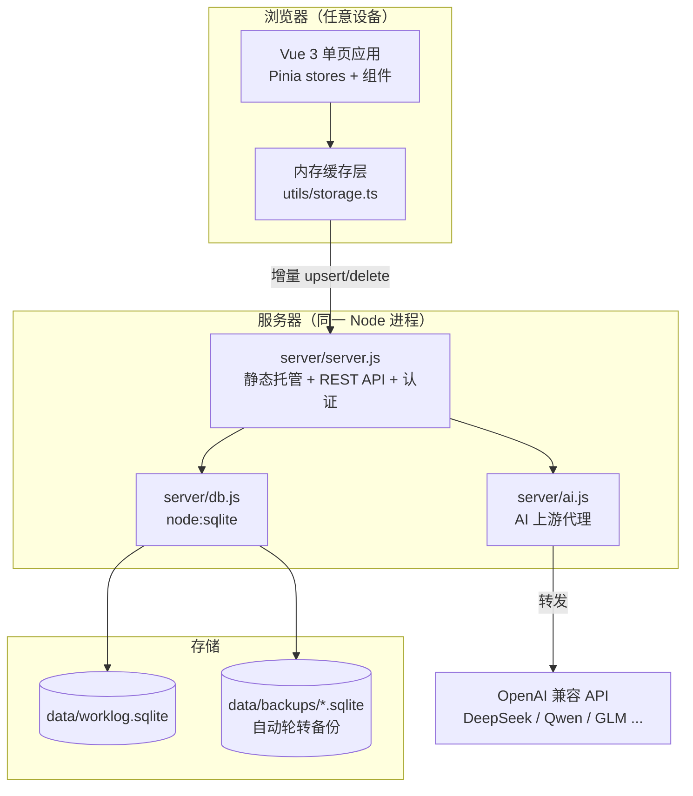

# 工作日志管理系统 - 技术架构文档

> 更新于 v2.0.0。v1.x 的纯浏览器（localStorage）架构已废弃，当前为客户端/服务器架构。

## 1. 总体架构



一个 Node 进程同时提供前端静态托管和 `/api` 接口（端口 4173），前后端同源、无 CORS。

## 2. 技术栈

| 层 | 技术 |
|---|---|
| 前端 | Vue 3 + TypeScript + Vite + Pinia + Vue Router + Naive UI |
| 富文本渲染 | marked + DOMPurify（AI/导入内容消毒后 v-html） |
| 后端 | Node.js ≥ 24，零 npm 依赖（http 模块 + 内置 node:sqlite） |
| 存储 | SQLite（WAL 模式），9 个集合 + 配置 + 会话 |
| 认证 | 单用户密码（sha256+salt），HttpOnly Cookie 会话（30 天） |
| AI | 服务端代理到 OpenAI 兼容接口，Key 只存服务端 |

## 3. 数据模型

SQLite 三张表：

- **collections** `(name, id, seq, data JSON)` —— 9 个集合：projects / todos / workLogs / clients / visitRecords / reports / planTasks / aiMessages / **deleted**（回收站）
- **settings** `(name, data JSON)` —— aiProvider（含 apiKey）、projectPhases、meta（seeded/seededWith）
- **sessions** `(token, expires_at)` —— 登录会话

## 4. 数据同步协议（多设备安全的核心）

- 前端每个集合维护 `lastSynced` 快照；保存操作计算出**实体级增量**（upserts + deletes），
  `POST /api/collections/:name/changes` 按实体应用。多设备并发编辑时只触碰各自提交的 id，
  不会整表互相覆盖；同一实体同时被修改时 last-write-wins。
- 比较使用键序无关的规范化 JSON（`stableStringify`），字段顺序漂移不产生误报增量。
- 窗口获得焦点时拉取服务器状态合并（有未同步本地更改时跳过）；页面关闭时 sendBeacon 兜底。
- 所有请求带 15s 超时；同步失败进入离线模式横幅提示，稍后自动补同步。

## 5. 认证与安全

- `POST /api/auth/login`：sha256(salt+password) 校验，签发 30 天会话（HttpOnly + SameSite=Lax）
- 除 login/health 外所有 `/api` 接口需要会话（Cookie 或 Bearer）
- 登录与改密接口共享限流（每 IP 每 5 分钟 10 次）
- 密码来源：环境变量 `AUTH_PASSWORD` 优先，否则 `data/config.json`（首启生成随机密码）
- 改密码端点成功后使其他设备会话失效
- AI Key 只存在服务端 settings 表；导出 JSON 备份自动剔除
- 静态服务路径穿越防护；上传体积 10MB 上限；SPA 回退

## 6. 自动备份

`VACUUM INTO` 一致性快照，触发：启动 / 每 24 小时 / 导入数据前；保留最近 14 份。
应用内「系统设置 → 数据备份」可查看与下载；`POST /api/backup` 手动触发。

## 7. 回收站

删除的项目/日志/待办/客户/拜访/报告/计划任务进入 `deleted` 集合（含原数据与时间戳），
30 天后应用初始化时自动清除；应用内「系统设置 → 回收站」可恢复或彻底删除。

## 8. 前端数据层

`utils/storage.ts` 维持与旧 localStorage 版一致的**同步**读写签名，内部为
"内存缓存 + 增量推送"，stores / views / services 无感知迁移。路由守卫
（`router/index.ts`）在首次导航前完成 `ensureInit`、演示数据播种和旧版数据合并迁移
（按 id 合并，不覆盖服务器已有数据），任何异常不阻断导航。

## 9. 目录结构

```
server/
  server.js   # HTTP 服务、认证、API 路由、静态托管、备份调度
  db.js       # SQLite 封装（集合/设置/会话/备份）
  ai.js       # AI 上游代理（含 max_tokens 降级兼容）
  test/api.test.js  # API 集成测试（node --test）
frontend/src/
  utils/storage.ts     # 缓存 + 增量同步数据层（diff/merge 纯函数有单测）
  utils/legacyMigration.ts  # v1.x localStorage 数据迁移
  utils/date.ts        # 本地日期工具（全项目统一）
  stores/              # Pinia（planTasks 已收编为正式 store）
  components/          # LoginOverlay / TrashModal / BackupsModal / PasswordModal 等
  views/               # Dashboard / Calendar / Projects / Todos / Clients / Settings
```

## 10. 测试与部署

- 前端：`npm run build`（vue-tsc + vite）、`npm test`（vitest，同步层单测 15 用例）
- 后端：`npm test`（node --test，API 集成测试 15 用例）
- 部署：Docker / NAS / 云服务器见 `docs/deployment.md`
