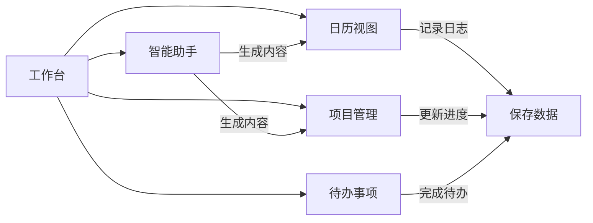

# 工作日志管理系统 - 需求文档

## 1. 产品概述
地方国企解决方案经理岗位的专业工作日志管理系统，用于记录日常工作、跟踪项目进度、管理待办事项，并集成大模型辅助功能，提升工作效率和文档质量。

## 2. 核心功能

### 2.1 用户角色
| 角色 | 注册方式 | 核心权限 |
|------|----------|----------|
| 解决方案经理 | 本地初始化 | 完整功能使用权限 |

### 2.2 功能模块
1. **工作台（首页）**：项目概览、今日待办、工作趋势统计
2. **日历视图**：按日期查看和补录工作日志
3. **项目管理**：创建项目、跟踪进度、管理项目成员和资源
4. **待办事项**：添加、编辑、完成待办，支持关联项目
5. **智能助手**：大模型辅助撰写日志、生成周报、提炼要点
6. **设置**：系统配置、数据备份与恢复

### 2.3 页面详情
| 页面名称 | 模块名称 | 功能描述 |
|----------|----------|----------|
| 工作台 | 项目卡片 | 显示所有项目及其进度百分比、待办数量 |
| 工作台 | 今日待办 | 展示当天待办事项，支持快速标记完成 |
| 工作台 | 工作趋势 | 近7天工作日志数量统计图表 |
| 日历视图 | 日历导航 | 月视图展示，支持切换月份 |
| 日历视图 | 日志记录 | 点击日期添加/编辑当天工作日志 |
| 日历视图 | 补录功能 | 支持补录历史日期的工作日志 |
| 项目管理 | 项目列表 | 卡片式展示所有项目，支持搜索和筛选 |
| 项目管理 | 项目详情 | 展示项目进度、关联待办、项目成员、里程碑 |
| 项目管理 | 进度编辑 | 拖动进度条或输入百分比更新项目进度 |
| 待办事项 | 待办列表 | 展示所有待办，支持按状态/项目筛选 |
| 待办事项 | 待办编辑 | 添加、编辑、删除待办，设置优先级和截止日期 |
| 智能助手 | 智能输入 | 提供日志模板、自动补全、格式优化 |
| 智能助手 | 内容生成 | 根据历史记录生成周报、月报、项目总结 |
| 设置 | 基础设置 | 主题切换、语言选择、界面配置 |
| 设置 | 数据管理 | 数据导出（JSON/Excel）、数据导入、清空数据 |

## 3. 核心流程
用户登录系统后，可在工作台查看项目和待办概览；通过日历视图记录每日工作；在项目管理模块跟踪项目进度；在待办事项中管理任务；使用智能助手辅助工作内容生成。

## 4. 用户界面设计

### 4.1 设计风格
- **主色调**：蓝色系（#1890ff）体现专业性，辅以柔和的浅蓝背景
- **次要颜色**：橙色（#fa8c16）用于强调和待办提醒，绿色（#52c41a）表示完成状态
- **按钮风格**：圆角矩形（8px），轻微阴影，悬停时有颜色渐变
- **字体**：Inter 或系统默认无衬线字体，标题 18-20px，正文 14-16px
- **布局风格**：卡片式布局，清晰的区域分隔，充足的留白
- **图标风格**：线性图标，简洁现代

### 4.2 页面设计概述
| 页面名称 | 模块名称 | UI 元素 |
|----------|----------|---------|
| 工作台 | 项目卡片 | 白色背景卡片，顶部显示项目名称和进度条，底部显示待办数量 |
| 日历视图 | 日期格子 | 网格布局，当天日期高亮显示，有日志的日期显示圆点标记 |
| 项目管理 | 详情页 | 分栏布局，左侧项目信息，右侧待办和里程碑时间线 |
| 智能助手 | 聊天界面 | 类 ChatGPT 对话式界面，支持多轮交互 |

### 4.3 响应式
桌面优先设计，支持平板和手机自适应，触摸区域优化，确保在各种设备上的可用性。

## 5. 数据持久化
本地存储使用 IndexedDB 或 LocalStorage，支持数据导出为 JSON 和 Excel 格式。
